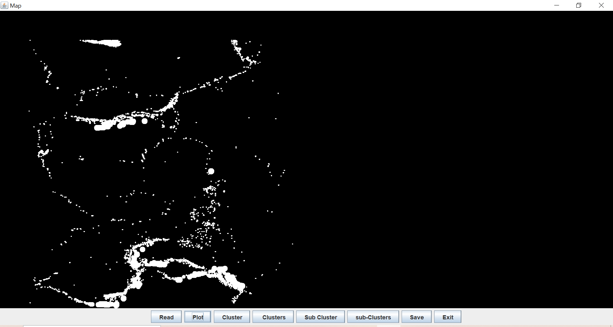
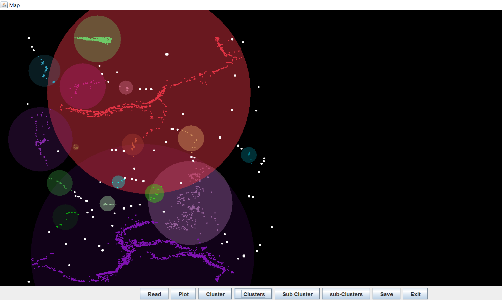
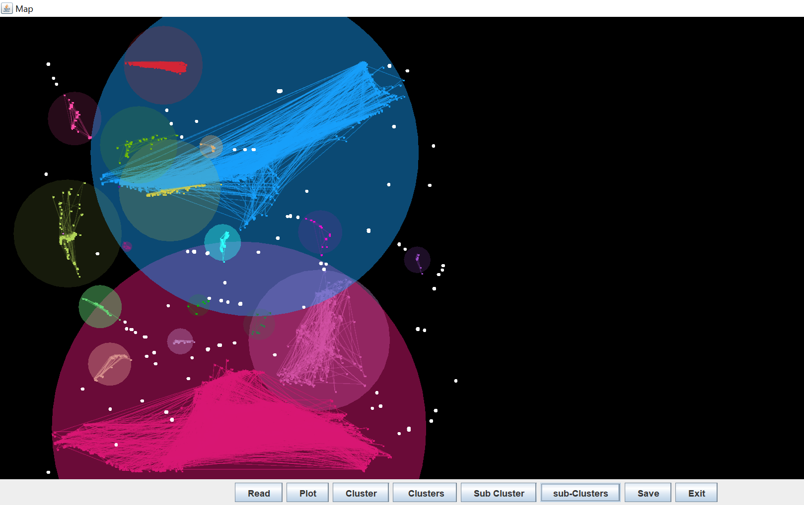

# 🌍 Earthquake Clustering Visualization Tool

This Java Swing application reads earthquake data from a CSV file, performs clustering based on spatial coordinates (latitude and longitude), and visualizes the clusters on a 2D map.

## 📌 Features

- 📥 **CSV Input**: Reads earthquake data from a file (`eq_1.csv`) containing fields like date, location, latitude, longitude, depth, and magnitude.
- 📊 **Normalization**: Normalizes latitude, longitude, depth, and magnitude for consistent plotting on the GUI.
- 🧠 **Custom Clustering Algorithm**: Implements a basic density-based clustering logic using core distance and ε-neighborhood.
- 📍 **Cluster Visualization**: Displays individual data points and their cluster boundaries using random colors.
- 💾 **Save Clustering Result**:
  - Saves clusters to a `Result.txt` file.
  - Exports cluster visualization as `.png` images.
- 🎨 **Graphical User Interface**: Built using Java Swing for an interactive experience.

## 🗂️ File Structure

Lat_lon_plot_4.java # Main Java file with all functionality
eq_1.csv # Input data file (not provided here)
plot1.png # Screenshot of raw data plotting
plot2.png & plot3.png # Screenshot of clustered data visualization
Result.txt # Output after clustering

## 🖼️ Screenshots

### ➤ Plot 1: Raw Earthquake Data Points


### ➤ Plot 2 & 3: Clustered Earthquake Data



## 🚀 How to Run

### Prerequisites:
- Java JDK (version 8 or above)
- Your IDE or terminal setup for compiling and running Java

### Steps:

1. **Clone or Download the Repository**:
   ```bash
   git clone https://github.com/Khushi0389/ClusteringAnalysis.git
   cd earthquake-clustering-java
Place Your Dataset:

Ensure the file eq_1.csv is present in the project root directory.

CSV format should follow this order:
Date, Latitude, Longitude, Depth, Magnitude, Place
Compile and Run the Application:
javac Lat_lon_plot_4.java
java Lat_lon_plot_4
GUI Buttons:

Read: Load and normalize data from eq_1.csv.

Plot: Plot raw data points on the canvas.

Cluster: Perform clustering using ε and minPts parameters.

Clusters: Visualize the clusters and save result to Result.txt.

Save: Export the current visualization as a PNG image.

Exit: Close the application.

🧠 Clustering Logic
The clustering is a custom DBSCAN-style algorithm:

Each point's core distance is calculated based on ε-radius and minPts.

A seed point with the smallest core distance starts a new cluster.

Points within the core distance of the seed are recursively added to the cluster.

🛠️ Customization
You can modify the following parameters directly in the code:

min_pts: Minimum number of points required to form a dense region.

eps: Epsilon radius for neighbor consideration.

eps_corr: For sub-clustering (currently unused).

You can also load a different CSV file by changing the filename in read_file() method.

📃 License
This project is for educational and research purposes. Feel free to fork, use, and improve it!

✨ This project is maintained by Khushi Gupta
GitHub:  https://github.com/Khushi0389


